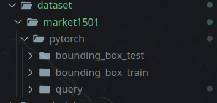
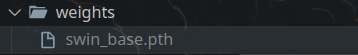

# PersonReID_ComputerVision
---
# How to build DB
- Cài depedencies: `pip install -r requirements.txt`.
- Download [weight](https://drive.google.com/file/d/1uh7tO34tMf73MJfFqyFEGx42UBktTbZU/view) của model Swin Transformer và bỏ vào thư mục `weights/`.
- Download [dataset](https://drive.google.com/drive/folders/1qaqBV1pf932Az7ULijaMyBWfVTp5GVcV?usp=sharing) đã cắt vào và giải nén vào `dataset/pytorch`.
- Cây thư mục nhìn giống như này:
    - 
    - 
- Build DB cho từng thư mục:
    ```bash
    python3 eval.py -d 'cuda' -s 3 -o './result' -p 'dataset/market1501/pytorch/bounding_box_test/head'
    ```
    - Trong đó `-o` là nơi lưu kết quả.
    - Trong folder kết quả:
      - `dump` là thư mục chứa các file lưu vector trích xuất bằng mô hình.
      - `label_mapping` là dictionary map **ID của pytorch dataset** với **ID của Market1501**.
      - `db_idx_mapping` là dictionary map **ID của DB** với **ID của Market1501**.
      - `db.index` là file DB (đọc bằng Faiss).